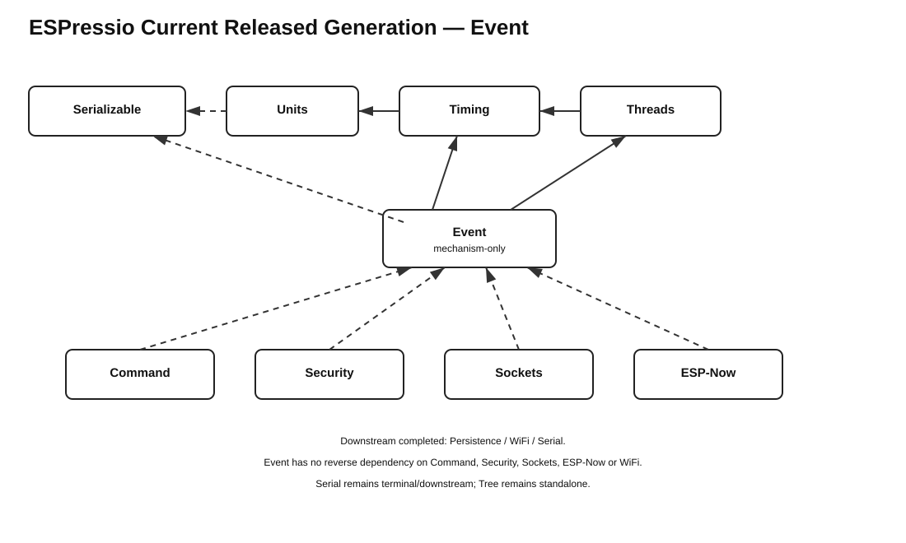

# ESPressio Dependency Chart — Current Released Generation



## Released generation

```text
Observable    3.0.2
Serializable  0.11.3
Units         0.2.7
Timing        2.2.8
Threads       3.1.7
Event         6.0.3
Command       1.0.3
Security      0.4.2
Persistence   0.3.2
Sockets       0.7.3
ESP-Now       0.8.3
WiFi          0.2.0
Serial        0.8.1
```

## Event dependencies

```text
Event 6.0.3
    -> Threads main
    -> Timing main
    -> Observable main
    - - -> Serializable main
            opt-in Serializable Events / Event Transport
```

Event remains a mechanism-only library. Domain-specific Event types and bridges are owned by their respective downstream libraries.

## Downstream integration direction

```text
Command  - - -> Event main
Security - - -> Event main
Sockets  - - -> Event main
ESP-Now  - - -> Event main
WiFi     - - -> Event main

Event -> Command   NONE
Event -> Security  NONE
Event -> Sockets   NONE
Event -> ESP-Now   NONE
Event -> WiFi      NONE
```

## Completed cascade

```text
Serializable 0.11.3
    -> Units 0.2.7
    -> Timing 2.2.8
    -> Threads 3.1.7
    -> Event 6.0.3
    -> Command 1.0.3 / Security 0.4.2
    -> Persistence 0.3.2 / Sockets 0.7.3 / ESP-Now 0.8.3
    -> WiFi 0.2.0
    -> Serial 0.8.1
```

Timing and Threads Event bridges remain in Event because Event already requires Timing and Threads for its core responsibilities. Serializable support remains opt-in. Serial remains terminal/downstream; ESPressio Tree remains standalone.
