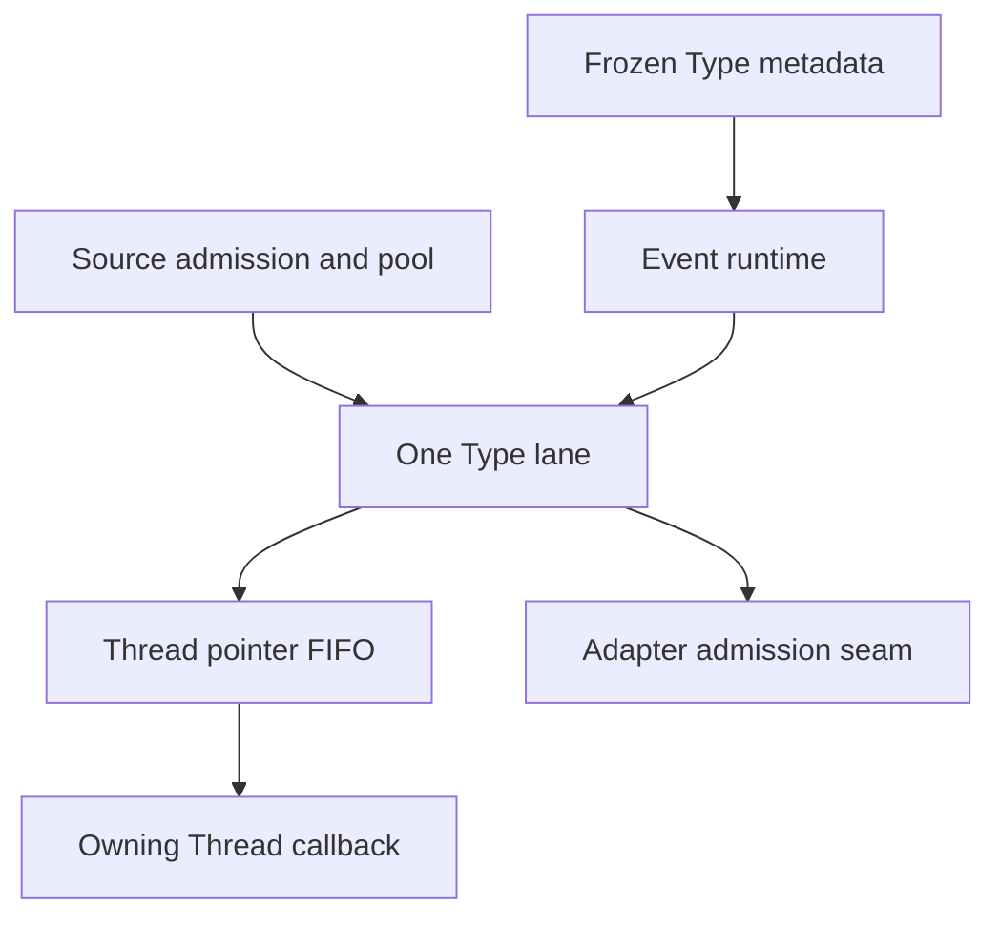

# ESPressio Event

Fixed-capacity occurrences with one compile-time Type, one owning pool and one serialized fanout lane per Type. This working branch implements the clean architecture reset; package version numbers remain unchanged pending separate release authorization.

Choose `Event<T>` for local occurrences, `SerializableEvent<T>` for local occurrences with a bounded schema, or `TransmissibleEvent<T>` for the same schema plus an occurrence delivery policy and remote identity. A Type has one tier, a strong nonzero 64-bit `EventTypeId`, a canonical diagnostic name, positive `MaximumLiveInstances`, and nonnegative `MaximumPendingInstances`. Transmissible Types require an installed durable System runtime identity before local source dispatch.

## Local delivery and bootstrap

Register Types in a fixed `Primitive::TypeDirectory<N>` and freeze it. Initialize the caller-owned Event `Runtime`, initialize consumer Threads and adapter bindings, then call `Runtime::Start()` to validate and freeze all targets before publishing family admission. Listener bindings are fixed owner/member thunks installed during `OnInitialization`; there is no runtime listener registry or first-use auto-registration.

```cpp
#include <ESPressio_Event.hpp>
#include <ESPressio_ThreadWith.hpp>
#include <ESPressio_Precision.hpp>
namespace E = ESPressio::Event;
using namespace ESPressio;
struct Temperature final : E::Event<Temperature> {
    static constexpr E::EventTypeId TypeId{0x1001};
    static constexpr std::string_view CanonicalName="example.temperature";
    static constexpr std::size_t MaximumLiveInstances=4, MaximumPendingInstances=2;
    int MilliCelsius;
    explicit Temperature(int value) noexcept : MilliCelsius(value) {}
};
using Inbox=E::ThreadCapability<E::SharedPendingCapacity<0>,Temperature>;
class Display final : public Threads::ThreadWith<Inbox,Threads::Precision<8>> {
    int _last=0;
    void Receive(const Temperature& sample) { _last=sample.MilliCelsius; }
    void OnInitialization() override {
        if(!GetCapability<E::ThreadCapabilityTag>().Listen<Temperature>(*this,&Display::Receive))
            throw 1;
    }
public:
    ~Display() override { (void)Shutdown(); }
    int Last() const noexcept { return _last; } // Read after Shutdown, or in this Thread.
};
// Install platform execution/synchronization providers before setup.
Primitive::TypeDirectory<1> directory;
E::Runtime events;
Display display;
void InitializeExample() {
    if(directory.Register<Temperature>()!=Primitive::TypeDirectoryRegistrationStatus::Success) return;
    if(directory.Initialize()!=Primitive::TypeDirectoryInitializationStatus::Success) return;
    if(events.Initialize(directory.View())!=E::EventRuntimeStatus::Success) return;
    if(display.Initialize()!=Threads::ThreadStatus::Success) return;
    if(events.Start()!=E::EventRuntimeStatus::Success) return;
    if(display.Start()!=Threads::ThreadStatus::Success) return;
    (void)Temperature::TryDispatch(23125);
}

```

`TryDispatch(args...)` rejects immediately when the admission gate, pool or single lane is unavailable, without constructing a payload. `Dispatch(args...)` waits for capacity on a provider signal; never call it from an ISR or from a context that must release the same capacity. Synchronous same-Type redispatch from a callback that holds capacity needed by that dispatch is unsupported; there is no hidden cycle detector. Both capture qualified System time at API entry, before any wait. Once accepted, the original pool object and conceptual message ID remain the same across all consumers. A failed constructor returns its reserved slot; consumed identifiers may leave gaps and never wrap.

A Thread capability owns one pointer FIFO. Positive per-Type pending quotas are private; zero selects the explicitly configured shared quota. Private Types cannot borrow shared capacity. The Type lane tries every healthy target before waiting on owed capacity; a slow consumer cannot delay the first admission attempt to another target. Consumer dequeue frees quota and publishes capacity before invoking its const callback. Callbacks execute on the owning Thread, with lease release on both return and exception. Pause preserves queued work; quiescence drops queued leases without callbacks.

## Serialization and transmission

```cpp
#include <ESPressio_Event.hpp>
namespace E = ESPressio::Event;
using namespace ESPressio;
struct Sample final : E::SerializableEvent<Sample> {
    static constexpr E::EventTypeId TypeId{0x1002};
    static constexpr std::string_view CanonicalName="example.sample";
    static constexpr std::size_t MaximumLiveInstances=4, MaximumPendingInstances=1;
    std::int32_t Value=0;
    ESPRESSIO_SERIALIZABLE_TYPE(Sample)
    ESPRESSIO_SERIALIZABLE_SCHEMA_VERSION(1)
    ESPRESSIO_SERIALIZABLE_PROPERTIES(ESPRESSIO_PROPERTY("value",Value))
};
static_assert(Serializable::IsBoundedSerializable<Sample>);


```

Use bounded Serializable properties and containers; unbounded schema graphs are rejected. A `TransmissibleEvent<T>` additionally declares `using DeliveryPolicy = ...` satisfying the Primitive occurrence-policy contract. `MaximumCompletePrimitiveWireBytes<T, Format>` is the exact bounded allocation requirement for the selected binding format. The binding selects DirectBinary, CBOR or JSON; occurrences do not carry an independent format selector.

The Event v1 header is exactly 53 little-endian bytes followed by payload. It contains family u16 at 0, version u16 at 2, Type u64 at 4, conceptual message u64 at 12, origin device 16 bytes at 20, incarnation u32 at 36, qualified origin time u64 at 40, reliability u8 at 48, and payload length u32 at 49. Receivers require the exact complete frame length and reject invalid identifiers, reliability, version, schema and bounds. Native struct layout is never a wire representation.

Supply a fixed receipt array in `RuntimeConfiguration` before initializing inbound bindings with `BindInbound<T, Format>()`. `TryAdmitRemote` reserves an in-progress receipt and Type capacity before bounded decode, commits the admitted receipt only after the lane accepts, and returns admission evidence only after that commit. Concurrent duplicates cannot produce another delivery. Failed attempts free their provisional receipt; live entries are never evicted. Expiry uses canonical monotonic time and the declared residence budget. Remote occurrences preserve source identity/time and fan out locally without creating another external campaign.

`EventOutboundBinding<T>` is an adapter-owned fixed seam. Its framework admission thunk must synchronously encode into generic Adapter-owned bounded bytes before returning acceptance. It retains no application payload pointer after admission and contains no physical transport, retry or acknowledgement engine. Link completion is not primitive admission evidence. The adapter owns policy scheduling and notifies capacity changes through the binding.

P1 descriptors expose immutable tier/schema/policy/size metadata. Full SHA-256 contract fingerprints consume canonical schema semantics, the normalized policy bytes and wire contract. Deployment capacities, diagnostic names, routes and selected binding format do not affect compatibility. Changes to application validator semantics must be represented by a schema/contract version change; function addresses are never semantic fingerprints.

## Ownership, shutdown and resources

Runtime configuration, directory entries, caller-provided receipts, adapter owners and consumer objects must outlive their uses. Stop external ingress before destroying the family runtime. Shutdown closes admission, drains already registered remote calls, quiesces targets, wakes blocked producers and joins Type lanes. Failed joins retain ownership for retry. Consumer classes call `Shutdown()` before their own callback state is destroyed; adapters detach their binding before destroying resources used by admission. Process-static Type runtimes retain their capacity-notification latches for late lease releases and cannot restart after final shutdown. Bootstrap failures can roll back before topology is installed.

`EventLease` is one move-only control pointer. `Retain()` is explicit, bounded and refcount-overflow checked; final release destroys the in-place payload before freeing its pool slot. Retained application leases keep their original slot occupied, so their lifetime is a capacity decision. Detached payload copies have no occurrence facts.

`EventTypeRuntime<T>::StaticResources()`, `GetResourceProfile()` and capability profiles report concrete resident sizes, alignment, pool slots, pending pointers, counters, target nodes, listener bindings and configured stacks. Each Type has one T1 execution context and three signals: the lane wake, blocked-producer capacity and owed-target capacity. Remote-enabled family coordination adds one drain signal. Event capabilities add no Thread context or work signal. Component figures are already included in resident bytes. Platform task/signal control allocations are explicitly unknown until provider accounting supplies them; there is no hidden heap fallback on hot paths.

The optional caller-owned `SystemClockEventBridge` maps explicit Timing notifications to bounded Serializable diagnostic Types through `TryDispatch`. Register the Types you consume before bootstrap. Unavailable observations increment a counter. Ordinary clock reads produce no events. Quiesce clock-notifying callers before detaching/destroying the borrowed observer bridge. Thread lifecycle is available through the consolidated Thread contracts rather than Event bridge hierarchies.

## Dependencies and validation

Production dependencies are exactly System, Primitive, Task, Threads, Timing and Serializable. Units and Observable are transitive test/Timing requirements. Radio, Mesh, Adapters, RadioAdapters, Command, State, Security and physical transports are forbidden reverse dependencies.



Build against the sibling working-branch repositories:

```sh
cmake -S tests -B build -DESPRESSIO_DEPENDENCIES=/path/to/repositories
cmake --build build --parallel
ctest --test-dir build --output-on-failure
python tests/validate_public_surface.py --dependencies /path/to/repositories
python tools/check_dependency_boundaries.py
```

The validation report records the semantic classification of replaced tests and current gates. Hardware execution and clock certification require the actual platform providers and hardware; host tests do not establish those guarantees.
