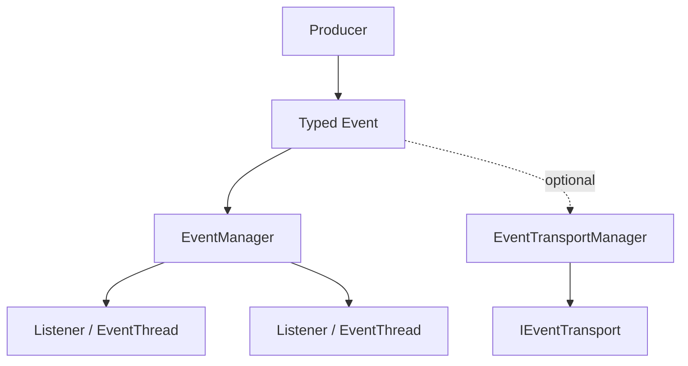

# ESPressio Event

> Documentation baseline: **1.0.0**

ESPressio Event provides asynchronous Event-Driven Development infrastructure for the ESPressio Development Platform.

Producers dispatch strongly typed Event data contracts without knowing which consumers exist; listeners process those Events independently on Event-aware Threads.

## Choose your documentation path

### Using the library

- [Getting Started](Getting-Started)
- [Typed Events and Identity](Typed-Events-and-Identity)
- [Dispatch Queue and Stack](Dispatch-Queue-and-Stack)
- [Event Listeners](Event-Listeners)
- [EventThread](EventThread)
- [PrecisionEventThread](PrecisionEventThread)
- [Event Lifecycle Timing](Event-Lifecycle-Timing)
- [Bounded Queues and Diagnostics](Bounded-Queues-and-Diagnostics)
- [Serializable Events](Serializable-Events)
- [Event Transport](Event-Transport)
- [Runtime Serializable Discovery](Runtime-Serializable-Discovery)
- [Timing and Thread Bridges](Timing-and-Thread-Bridges)
- [Event versus Observable](Event-versus-Observable)
- [Memory Behaviour](Memory-Behaviour)

### Extending the library

- [Extension Architecture](Extension-Architecture)
- [Event Type Identity Contract](Event-Type-Identity-Contract)
- [Listener Registry Contract](Listener-Registry-Contract)
- [Implementing Event Transports](Implementing-Event-Transports)
- [Serializable Event Registration](Serializable-Event-Registration)
- [Adding Integration Bridges](Adding-Integration-Bridges)
- [Testing Event Extensions](Testing-Event-Extensions)

## Architecture

Event is the asynchronous counterpart to ESPressio Observable; it is not a synchronous callback registry.